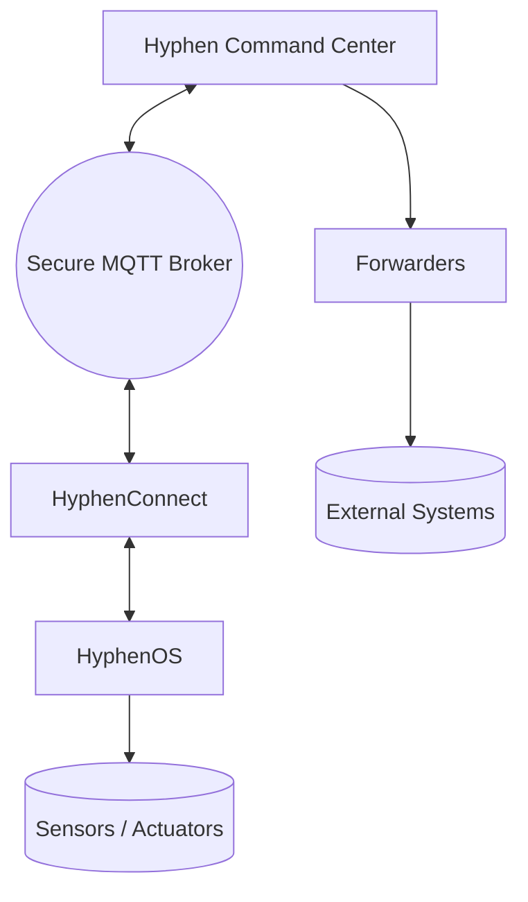

# HyphenOS

**HyphenOS** is the firmware foundation of the **Hyphen Ecosystem** — built for real-time, always-ready, field-deployed IoT systems for **environmental sensing and interactive monitoring**.

Our long-term goal is simple to say and hard to do:

> **Never fail. Never hang. Never miss a measurement. Always recover.**

While we haven’t yet achieved “never fail” in the absolute sense (no IoT OS in the world truly has), **this remains our primary engineering objective**. Every subsystem in HyphenOS is designed to recover, reconnect, self-heal, and continue sensing with the **lowest possible downtime**, especially in **resource-limited, remote, or disaster-prone deployments**.

HyphenOS is optimized for use with **Hyphen Command Center**, but it is **fully usable independently**.  
To enable remote control, telemetry, OTA updates, and device configuration, **HyphenOS requires HyphenConnect**.

---

## Features

- 🛰️ **IoT firmware optimized for field deployments**
- 🔁 **Auto-reconnect & self-recovery networking**
- 📡 **WiFi + Cellular (SIM7600) hybrid connectivity**
- 🔒 **Secure MQTT with TLS (device, private key, and CA pinned)**
- 🔧 **Real-time variable and function remote access (HyphenConnect)**
- 🌍 **Fleet-wide OTA (cloud or local flash)**
- 📡 **Environmental sensor support + forwarder pipelines**
- ⚡ **Non-blocking architecture with optional threaded mode**
- 🧭 Designed for **flood, hydrology, climate and early-warning systems**

---

# Architecture Overview

Hyphen Ecosystem Overview

```
Hyphen Ecosystem Overview

+-----------------------+            +----------------------------+
|   Hyphen Command      |            |    External Services       |
|       Center          |            | (Dashboards, Databases,    |
|  - Device Fleet Mgmt  |   MQTT     |  Alerts, Integrations)     |
|  - OTA Updates        | <------->  |                            |
|  - Telemetry Viewer   |   HTTPS    |  (via Forwarders/Decoders) |
+----------+------------+            +-------------+--------------+
           |                                           ^
           |                                           |
           v                                           |
+----------+------------+                              |
|     Hyphen Connect     |                             |
|  (Client Networking)   |                             |
|  - Secure MQTT Auth    |                             |
|  - Session Handling    |                             |
|  - WiFi / Cellular     |                             |
+----------+------------+                              |
           |                                           |
           v                                           |
+----------+------------+                              |
|        HyphenOS        |                             |
|  (Embedded Runtime)    |                             |
|  - Sensor Drivers      |                             |
|  - Control Loops       |                             |
|  - OTA + Watchdogs     |                             |
|  - Non-blocking Core   |                             |
+-----------------------+------------------------------+
```

### Sequence of Operation

1. Device boots → HyphenOS starts.
2. HyphenConnect initializes WiFi or Cellular.
3. Secure MQTT handshake occurs using device certificates.
4. Device registers itself with Command Center.
5. Command Center can now:
   - Send function calls
   - Request variables
   - Push OTA firmware
   - Stream telemetry
6. Optional: Forwarders + Decoders route data to other systems using Command Center.

# Getting Started (Quick Flash Guide)

User Hyphen Command Center to Flash your device

Or:

1. Install Requirements

- VS Code
- PlatformIO Extension
- Git

```bash
git clone https://github.com/similie/hyphen-os.git
cd hyphen-os
```

## Certificate Setup

To connect manually (outside of Hyphen Command Center), place your MQTT certificates here:

- src/certs/root-ca.pem
- src/certs/device-cert.pem
- src/certs/private-key.pem

These filenames **must** match exactly.  
You may optionally include a chain root such as Let's Encrypt:

- src/certs/isrgrootx1.pem

## (If using Hyphen Command Center, these are provisioned for you automatically.)

## PlatformIO Build Configuration

> **Note:** This file is **not included in the repo**.  
> Hyphen Command Center generates it automatically.  
> If building manually, create `platformio.ini` similar to:

```ini
[env:esp32dev]
platform = espressif32
board = esp32dev
framework = arduino
monitor_speed = 115200
upload_speed = 921600
board_upload.flash_size = 16MB
board_build.partitions = part_16mb_app.csv
monitor_filters = esp32_exception_decoder

board_build.embed_txtfiles =
  src/certs/root-ca.pem
  src/certs/device-cert.pem
  src/certs/private-key.pem
  src/certs/isrgrootx1.pem

lib_deps =
  guernica0131/HyphenConnect@^1.0.9
  envirodiy/SDI-12@2.1.4
  emanuelefeola/ArduinoHttpClient@^0.5.0
  ArduinoJson@^7.4.2
  https://github.com/similie/Adafruit-VC0706-Serial-Camera-Library
  greiman/SdFat@^2.2.3
  adafruit/Adafruit INA219

build_flags =
  -D CORE_DEBUG_LEVEL=ARDUHAL_LOG_LEVEL_VERBOSE
  -D CELLULAR_APN="{apn}"
  -D GSM_SIM_PIN="{sim_pin}"
  -D MQTT_IOT_ENDPOINT="{mqtt_endpoint}"
  -D MQTT_IOT_PORT={mqtt_port}
  -D DEVICE_PUBLIC_ID="{unique-id-on-network}"
  -D CONNECTION_TYPE={connection_type}
  -D TINY_GSM_MODEM_SIM7600
  -D LED_PIN=14
  -D UART_BAUD=115200
  -D CELLULAR_PIN_TX=27
  -D CELLULAR_PIN_RX=26
  -D CELLULAR_POWER_PIN_AUX=4
  -D CELLULAR_POWER_PIN=25
  -D DEFAULT_WIFI_SSID="{wifi_ssid}"
  -D DEFAULT_WIFI_PASS="{wifi_pass}"
  -D MQTT_TOPIC_BASE="{topic_base}"
  -D MQTT_MAX_PACKET_SIZE=2048
  -D OTA_ALLOWED_HOSTS="hyphen-api.similie.com,api.hyphen.systems"
  -D MQTT_KEEP_ALIVE_INTERVAL=300
  -D MQTT_KEEP_ALIVE_INTERVAL_LOOP_OFFSET=0.04
  -D MQTT_SOCKET_TIMEOUT=20
  -D HYPHEN_THREADED
  -D NETWORK_MODE=2
  -D CONFIG_SPIRAM_USE_CAPS_ALLOC=1
  -D DISABLE_FS_H_WARNING
  -D BOARD_HAS_PSRAM
  -D BUILD_TIMESTAMP=$UNIX_TIME
```



# ROADMAP

| Feature / Goal                        | Status      | Description                                                                 |
| ------------------------------------- | ----------- | --------------------------------------------------------------------------- |
| Self-Healing "Never Fail" Runtime     | In Progress | Core architecture focused on recovery and uptime in remote deployments.     |
| Local + Cloud OTA Updates             | Stable      | OTA supported over WiFi and Cellular with authenticated update validation.  |
| Unified Sensor + Peripheral Framework | Active      | Supports SDI-12, I2C, analog, GPS, cameras, storage, and expansion modules. |
| Hybrid Networking (WiFi + Cellular)   | Stable      | Automatic fallback, reconnection, and adaptive network recovery.            |
| Dual-SIM / Roaming Support            | Planned     | Intended for deployments across roaming or cross-border networks.           |
| Edge Analytics & TinyML Support       | Planned     | Lightweight inference for environmental anomaly and trend detection.        |
| Full Power-Cycle + Watchdog Hardening | In Progress | Goal: multi-year uptime with no manual physical resets.                     |

HyphenOS is built for real-world reliability in remote environments, and we welcome contributions that move us closer to resilient and self-recovering field deployments.

Ways to contribute:

- Report real-world reliability issues and reconnection edge cases.
- Submit improvements to stability, watchdog logic, and network recovery.
- Add sensor driver integrations (SDI-12, I2C, RS-485, Modbus, analog).
- Contribute improvements to power management and low-power modes.
- Improve documentation, examples, deployment workflows, or field practices.
- Share PCB, shielding, antenna, or enclosure improvements for harsh environments.

To contribute:

1. Fork the repository
2. Create a feature branch
3. Submit a pull request with a clear explanation of the change

# License

This project is released under the MIT License.
You are free to use, modify, adapt, and integrate it into your own systems — commercial or otherwise — with attribution.

---

### About Similie

[Similie](https://similie.com) is a technology company based out of Timor-Leste, dedicated to developing innovative solutions that support international development initiatives and climate-change adaption. Our mission is to harness the power of technology to drive positive change and improve lives around the world. With a focus on sustainability, community engagement, and social impact, we strive to create products and services that make a real difference in people's lives.
